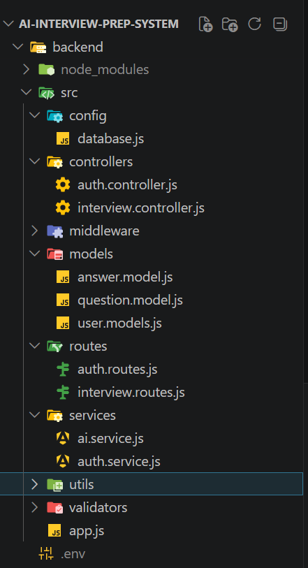

Hi folks !

This is AI-interview-prep-system project 
Where we can ask question and submit the answer the AI(Gemini) will read the answer and 
on the basis of our answer we get score from 1 to 10

Day-1

We will start with backend 

First we initialized the node.js project using command->  npm init-y

Then after we install the require packages
i.e -> npm i express mongoose bcryptjs jsonwebtoken

Then after we will follow the MVC pattern
i.e-> inside src folder we create multiple folders 
like models,controllers,routes,config,middleware,services,utils ...

Day -2

Integrating the AI features

npm install @google/genai dotenv
https://aistudio.google.com/
Then after we have to create the project on AIstdio and then generate the API key for Project ,which we will use in our node project.

Day -3
Dashboard & Performance Tracking
Sending the email while registering the User 