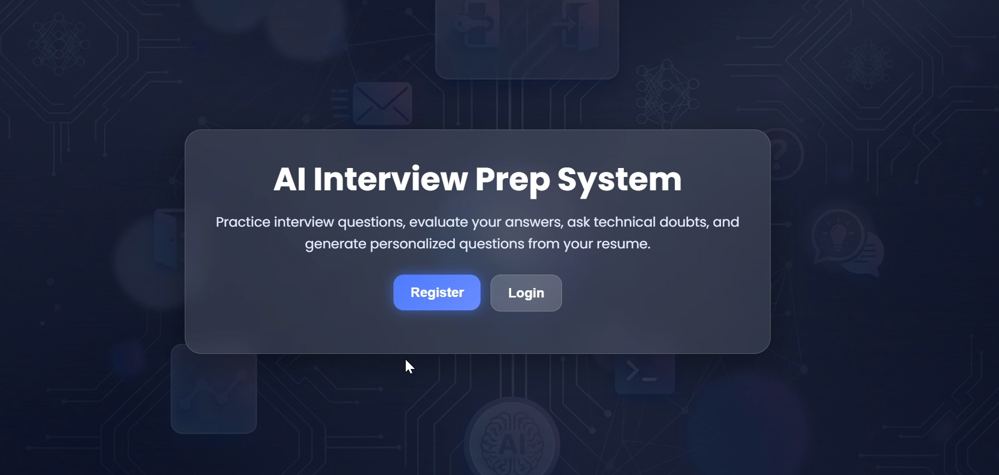
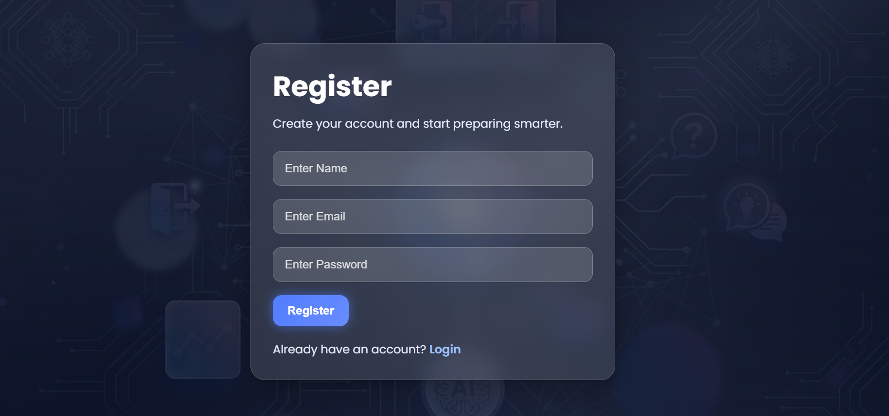
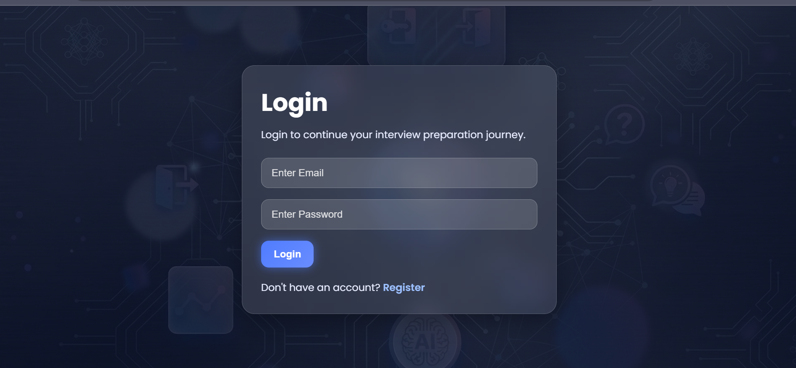
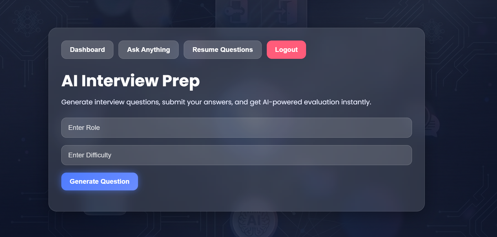
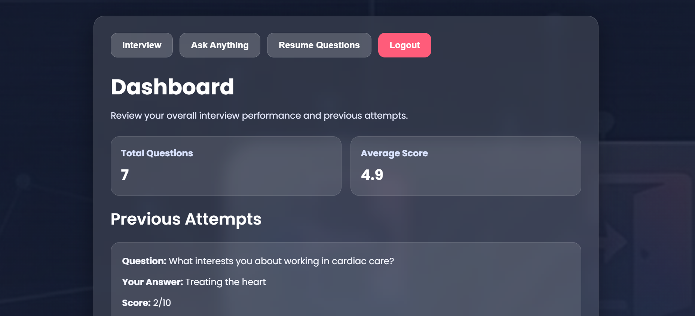
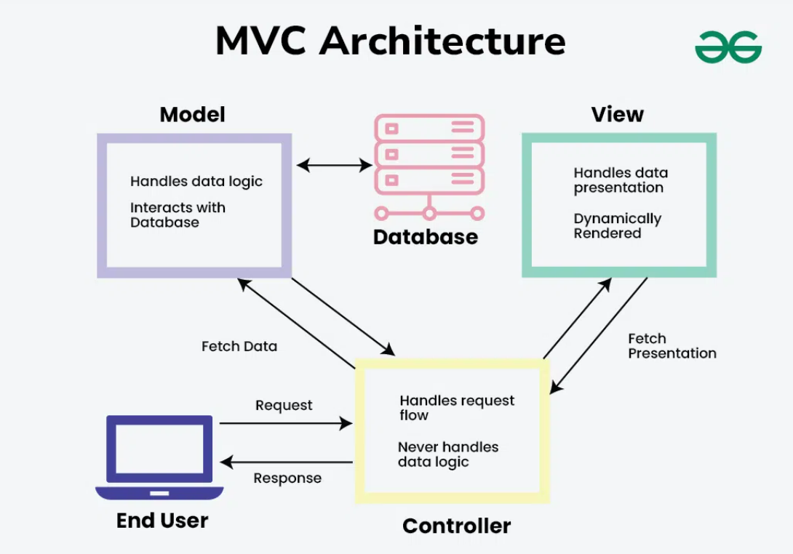

🚀 AI Interview Prep

An intelligent full-stack web application that helps users prepare for technical interviews using AI-generated questions based on role and difficulty level.

📌 Overview

AI Interview Prep is a modern web application designed to simulate real interview scenarios. Users can input their desired role and difficulty level, and the system generates relevant interview questions using AI.
Thenafter you will submit the answer and get the score from 1 to 10 based on your answer.

This project demonstrates full-stack development skills, API integration, and scalable backend architecture.

✨ Features
🔐 User Authentication (Register/Login with JWT)
🤖 AI-powered Question Generation
🎯 Role-based Interview Questions (e.g., Frontend, Backend, Full Stack)
📊 Difficulty Levels (Easy, Medium, Hard)
🔁 Retry Mechanism for AI API Calls
⚡ Fallback Model Support (ensures reliability when primary model fails)
📩 Email Integration (Welcome Email on Registration)
🗑️ Delete User Feature
🌐 RESTful API Architecture
💻 Clean and Responsive UI (React)

Home UI

Register UI

Login UI

AI Prep Mode

User Dashboard

🛠️ Tech Stack

Frontend:-
JavaScript
React.js
Vite
CSS

Backend:-
Node.js
Express.js
MongoDB (Mongoose)
AI Integration
Google Generative AI (Gemini API)
Primary Model: gemini-2.5-flash
Fallback Model: gemini-2.0-flash
Other Tools
JWT Authentication
Nodemailer (Email Service)
dotenv

This project Follows MVC 

🧠 How It Works
User registers/logs in.
User enters:
Role (e.g., Backend Developer)
Difficulty (Easy/Medium/Hard)
Request is sent to backend API.
Backend calls AI model to generate questions.
If the main model fails → fallback model is used.
Questions are returned and displayed on UI.

📁 Project Structure
AI-Interview-Prep/
│
├── backend/
│   ├── controllers/
│   ├── services/
│   ├── routes/
│   ├── models/
│   ├── config/
│   └── app.js
│
├── frontend/
│   ├── src/
│   ├── components/
│   ├── pages/
│   └── App.jsx
│
└── README.md

⚙️ Installation & Setup
1️⃣ Clone the Repository
git clone https://github.com/your-username/AI-Interview-Prep.git
cd AI-Interview-Prep
2️⃣ Backend Setup
cd backend
npm install

Create .env file:

PORT=8000
MONGO_URI=your_mongodb_uri
JWT_SECRET=your_secret
GEMINI_API_KEY=your_api_key
EMAIL_USER=your_email
EMAIL_PASS=your_email_password

Run backend:

npm run dev
3️⃣ Frontend Setup
cd frontend
npm install
npm run dev

🔌 API Endpoints
Auth Routes
Method	Endpoint	Description
POST	/api/auth/register	Register user
POST	/api/auth/login	Login user
DELETE	/api/auth/delete/:id	Delete user
AI Routes
Method	Endpoint	Description
POST	/api/ai/generate	Generate interview questions